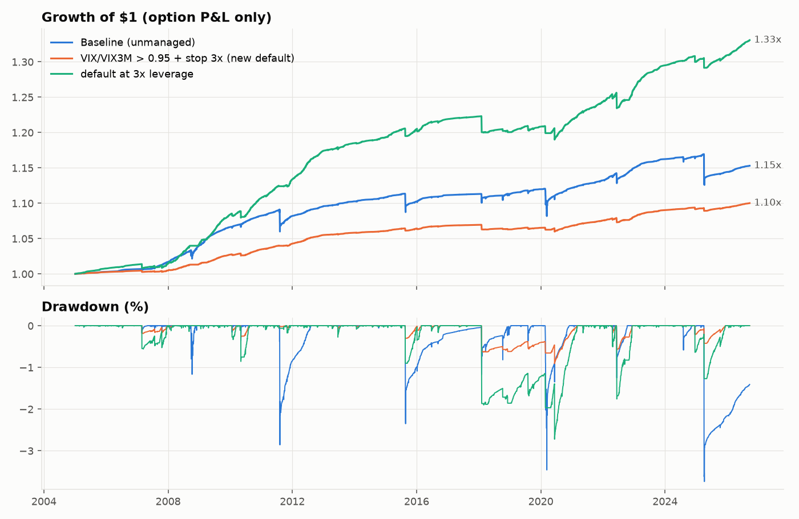
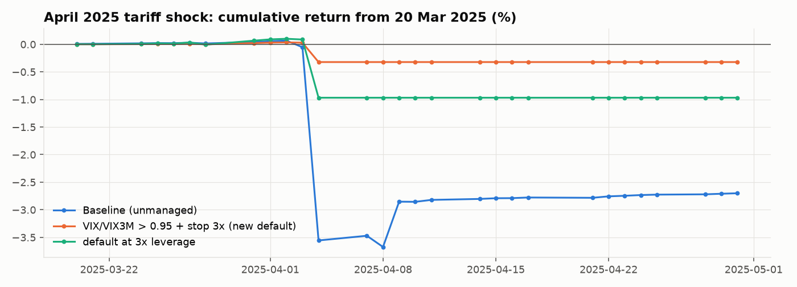

# Cheap hedges and regime filters for the S&P 500 short-put ladder

Cost model: ibkr_xsp. Backtest 2005-01-03 to 2026-09-22, option P&L only (no interest).
Every variant changes one thing relative to the unmanaged baseline, except the combinations.

## Summary

| Variant | CAGR | Vol | Sharpe | Max DD | Worst day | Worst month | Hedge spend p.a. | Stops p.a. | Days with no new sales |
|---|---|---|---|---|---|---|---|---|---|
| Baseline (unmanaged) | 0.66% | 1.40% | 0.48 | -3.74% | -3.51% | -2.74% | 0.00% | 0 | 0.00% |
| Regime: VIX/VIX3M > 1.00, no new sales | 0.60% | 0.73% | 0.82 | -2.16% | -1.98% | -1.85% | 0.00% | 0 | 8.77% |
| Regime: VIX/VIX3M > 0.95, no new sales | 0.46% | 0.51% | 0.92 | -1.95% | -1.14% | -1.33% | 0.00% | 0 | 20.61% |
| Regime: VIX/VIX3M > 0.95, half size | 0.56% | 0.86% | 0.66 | -2.34% | -1.93% | -1.59% | 0.00% | 0 | 0.00% |
| Regime: below 200-day average, no new sales | 0.38% | 0.62% | 0.62 | -2.64% | -1.12% | -1.99% | 0.00% | 0 | 21.71% |
| Regime: below 200-day average, half size | 0.52% | 0.92% | 0.57 | -2.64% | -1.87% | -1.98% | 0.00% | 0 | 0.00% |
| Regime: below 50-day average, half size | 0.53% | 0.82% | 0.64 | -2.52% | -1.75% | -1.91% | 0.00% | 0 | 0.00% |
| Regime: pause 3 days after a -1.5% day | 0.47% | 0.59% | 0.80 | -2.09% | -1.17% | -1.87% | 0.00% | 0 | 17.77% |
| Regime: skip days opening -1% or worse | 0.68% | 1.14% | 0.60 | -2.86% | -2.83% | -2.21% | 0.00% | 0 | 1.28% |
| Regime: strikes from max(VIX close, VIX open) | 0.66% | 1.30% | 0.51 | -3.21% | -3.09% | -2.35% | 0.00% | 0 | 0.00% |
| Hedge: wing at 1.3x distance (put spread) | -0.08% | 0.78% | -0.10 | -3.75% | -1.66% | -1.55% | 0.96% | 0 | 0.00% |
| Hedge: wing at 1.5x distance (put spread) | -0.00% | 1.08% | 0.00 | -4.07% | -2.49% | -2.25% | 0.76% | 0 | 0.00% |
| Hedge: wing at 2.0x distance (put spread) | 0.17% | 1.33% | 0.14 | -4.06% | -3.40% | -2.82% | 0.50% | 0 | 0.00% |
| Hedge: stop-loss at 3x premium | 0.54% | 0.76% | 0.71 | -2.84% | -2.28% | -2.16% | 0.00% | 22 | 0.00% |
| Hedge: stop-loss at 5x premium | 0.54% | 0.81% | 0.66 | -3.03% | -2.28% | -2.09% | 0.00% | 13 | 0.00% |
| Hedge: 1M 90% tail put, 25% of NAV | 0.39% | 1.52% | 0.26 | -3.17% | -2.98% | -2.88% | 0.71% | 0 | 0.00% |
| Hedge: 1M 95% tail put, 25% of NAV | 0.17% | 1.92% | 0.10 | -5.99% | -2.46% | -2.74% | 1.60% | 0 | 0.00% |
| Combo: VIX/VIX3M > 0.95 + stop 3x (new default) | 0.44% | 0.27% | 1.66 | -0.91% | -0.61% | -0.62% | 0.00% | 16 | 20.61% |
| Combo: VIX/VIX3M > 0.95 + stop 5x | 0.45% | 0.32% | 1.38 | -1.00% | -0.88% | -0.90% | 0.00% | 8 | 20.61% |
| Combo: VIX/VIX3M > 1.00 + stop 5x | 0.61% | 0.38% | 1.59 | -1.18% | -0.88% | -0.81% | 0.00% | 10 | 8.77% |
| Combo: default, stops cost 3x spread | 0.44% | 0.27% | 1.64 | -0.92% | -0.61% | -0.62% | 0.00% | 16 | 20.61% |
| Combo: default at 2x leverage | 0.88% | 0.53% | 1.66 | -1.82% | -1.22% | -1.24% | 0.00% | 16 | 20.61% |
| Combo: default at 3x leverage | 1.33% | 0.80% | 1.66 | -2.72% | -1.83% | -1.87% | 0.00% | 16 | 20.61% |

## Robustness (split sample and recent period)

| Variant | Sharpe 2005-15 | Sharpe 2016-26 | Sharpe since 2022 | CAGR since 2022 |
|---|---|---|---|---|
| Baseline (unmanaged) | 0.75 | 0.27 | 0.16 | 0.29% |
| Regime: VIX/VIX3M > 1.00, no new sales | 1.90 | 0.39 | 0.39 | 0.45% |
| Regime: VIX/VIX3M > 0.95, no new sales | 1.39 | 0.60 | 0.83 | 0.52% |
| Regime: VIX/VIX3M > 0.95, half size | 1.02 | 0.40 | 0.36 | 0.40% |
| Regime: below 200-day average, no new sales | 0.79 | 0.51 | 1.83 | 0.60% |
| Regime: below 200-day average, half size | 0.79 | 0.39 | 0.46 | 0.45% |
| Regime: below 50-day average, half size | 1.05 | 0.37 | 0.46 | 0.44% |
| Regime: pause 3 days after a -1.5% day | 1.39 | 0.46 | 0.74 | 0.50% |
| Regime: skip days opening -1% or worse | 0.75 | 0.44 | 0.27 | 0.38% |
| Regime: strikes from max(VIX close, VIX open) | 0.72 | 0.34 | 0.24 | 0.38% |
| Hedge: wing at 1.3x distance (put spread) | 0.08 | -0.23 | -0.34 | -0.33% |
| Hedge: wing at 1.5x distance (put spread) | 0.19 | -0.14 | -0.25 | -0.35% |
| Hedge: wing at 2.0x distance (put spread) | 0.35 | -0.02 | -0.12 | -0.24% |
| Hedge: stop-loss at 3x premium | 1.67 | 0.25 | 0.34 | 0.38% |
| Hedge: stop-loss at 5x premium | 1.44 | 0.22 | 0.28 | 0.33% |
| Hedge: 1M 90% tail put, 25% of NAV | 0.31 | 0.21 | -0.07 | -0.12% |
| Hedge: 1M 95% tail put, 25% of NAV | 0.13 | 0.05 | -0.12 | -0.22% |
| Combo: VIX/VIX3M > 0.95 + stop 3x (new default) | 3.38 | 0.92 | 1.50 | 0.48% |
| Combo: VIX/VIX3M > 0.95 + stop 5x | 3.42 | 0.68 | 0.86 | 0.41% |
| Combo: VIX/VIX3M > 1.00 + stop 5x | 3.99 | 0.76 | 0.93 | 0.55% |
| Combo: default, stops cost 3x spread | 3.34 | 0.91 | 1.48 | 0.48% |
| Combo: default at 2x leverage | 3.38 | 0.92 | 1.50 | 0.96% |
| Combo: default at 3x leverage | 3.38 | 0.92 | 1.50 | 1.44% |

## Stress episodes

| Variant | Aug 2011 | Aug 2015 | Feb 2018 | COVID 2020 | Apr 2025 |
|---|---|---|---|---|---|
| Baseline (unmanaged) | -1.74% | -1.53% | -0.52% | -1.61% | -3.69% |
| Regime: VIX/VIX3M > 1.00, no new sales | 0.04% | -1.34% | -0.59% | -1.58% | -2.12% |
| Regime: VIX/VIX3M > 0.95, no new sales | 0.01% | -1.34% | -0.59% | -1.21% | -0.33% |
| Regime: VIX/VIX3M > 0.95, half size | -0.86% | -1.44% | -0.56% | -1.41% | -2.01% |
| Regime: below 200-day average, no new sales | -0.86% | -1.34% | -0.52% | -1.82% | 0.01% |
| Regime: below 200-day average, half size | -1.30% | -1.44% | -0.52% | -1.71% | -1.84% |
| Regime: below 50-day average, half size | -0.85% | -1.09% | -0.53% | -1.59% | -1.85% |
| Regime: pause 3 days after a -1.5% day | -0.38% | -1.34% | -0.59% | -1.58% | -1.19% |
| Regime: skip days opening -1% or worse | -1.74% | -1.53% | -0.53% | -1.12% | -2.80% |
| Regime: strikes from max(VIX close, VIX open) | -1.64% | -1.92% | -0.53% | -1.46% | -3.16% |
| Hedge: wing at 1.3x distance (put spread) | -1.25% | -0.58% | -0.27% | -1.08% | -1.99% |
| Hedge: wing at 1.5x distance (put spread) | -1.80% | -0.87% | -0.39% | -1.46% | -2.89% |
| Hedge: wing at 2.0x distance (put spread) | -1.89% | -1.36% | -0.52% | -1.70% | -3.68% |
| Hedge: stop-loss at 3x premium | -0.92% | -0.80% | -0.81% | -2.25% | -2.37% |
| Hedge: stop-loss at 5x premium | -1.11% | -0.80% | -0.90% | -2.29% | -2.34% |
| Hedge: 1M 90% tail put, 25% of NAV | -1.73% | -1.51% | -0.53% | 3.23% | -2.90% |
| Hedge: 1M 95% tail put, 25% of NAV | -0.71% | -1.15% | -0.27% | 4.84% | -2.01% |
| Combo: VIX/VIX3M > 0.95 + stop 3x (new default) | -0.02% | -0.30% | -0.62% | -0.27% | -0.33% |
| Combo: VIX/VIX3M > 0.95 + stop 5x | 0.01% | -0.30% | -0.72% | -0.31% | -0.33% |
| Combo: VIX/VIX3M > 1.00 + stop 5x | 0.04% | -0.30% | -0.72% | -0.42% | -0.80% |
| Combo: default, stops cost 3x spread | -0.02% | -0.30% | -0.62% | -0.28% | -0.33% |
| Combo: default at 2x leverage | -0.04% | -0.60% | -1.24% | -0.55% | -0.65% |
| Combo: default at 3x leverage | -0.06% | -0.90% | -1.85% | -0.82% | -0.98% |

## Why the term-structure filter caught April 2025

VIX/VIX3M above 1 means the market prices more volatility over the next month than over the next three, which is the typical shape just before
and during sell-offs. It was already about 1.0 on 1-2 April 2025, before the 3-4 April crash:

| Close | VIX | VIX3M | VIX / VIX3M | New sales next day |
|---|---|---|---|---|
| 2025-03-24 | 17.48 | 19.04 | 0.918 | yes |
| 2025-03-25 | 17.15 | 19.05 | 0.9 | yes |
| 2025-03-26 | 18.33 | 19.84 | 0.924 | yes |
| 2025-03-27 | 18.69 | 19.89 | 0.94 | yes |
| 2025-03-28 | 21.65 | 22.01 | 0.984 | no |
| 2025-03-31 | 22.28 | 21.97 | 1.014 | no |
| 2025-04-01 | 21.77 | 21.82 | 0.998 | no |
| 2025-04-02 | 21.51 | 21.45 | 1.003 | no |
| 2025-04-03 | 30.02 | 27.38 | 1.096 | no |
| 2025-04-04 | 45.31 | 36.71 | 1.234 | no |
| 2025-04-07 | 46.98 | 36.88 | 1.274 | no |
| 2025-04-08 | 52.33 | 41.5 | 1.261 | no |
| 2025-04-09 | 33.62 | 29.92 | 1.124 | no |
| 2025-04-10 | 40.72 | 35.71 | 1.14 | no |

## Notes

* Wings (buying a further out-of-the-money put, turning each sale into a put spread) and tail puts are priced with the skew calibrated on the
  SPXW chain, which gets much steeper further out. That is why they cost 0.5-1.6% a year, more than the strategy earns, so they are not cheap here.
* Stop-losses are executed at the day's close at model value plus 2x the normal execution cost. A real stop in a fast market can fill worse,
  and a gap through the strike overnight is not protected. The row with 3x cost shows the sensitivity.
* The thresholds (0.95, 3x) were chosen after looking at this history. The split-sample columns show the effect holds in both halves, but
  treat the exact numbers as in-sample.
