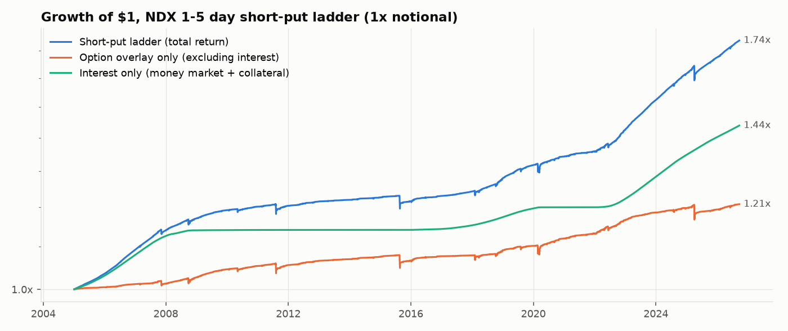
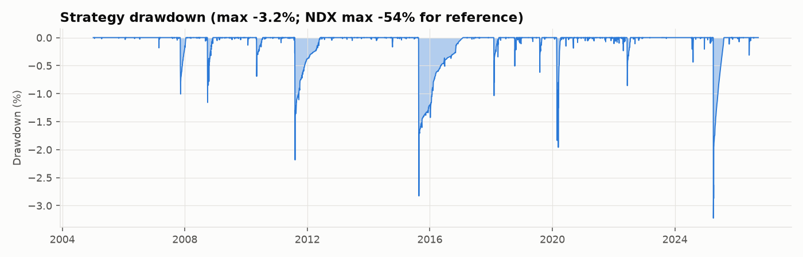
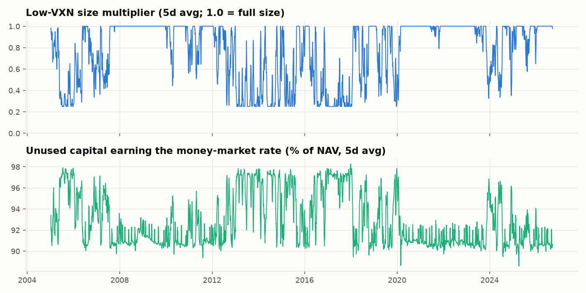
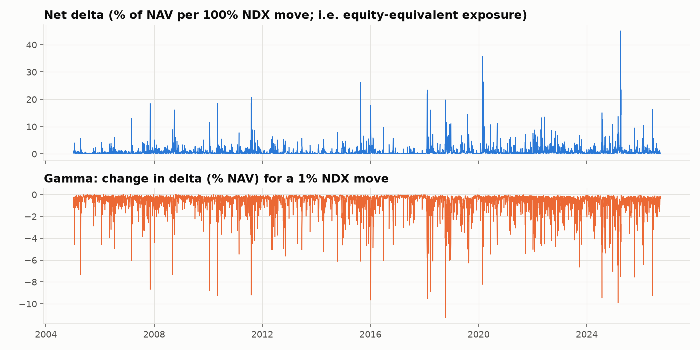
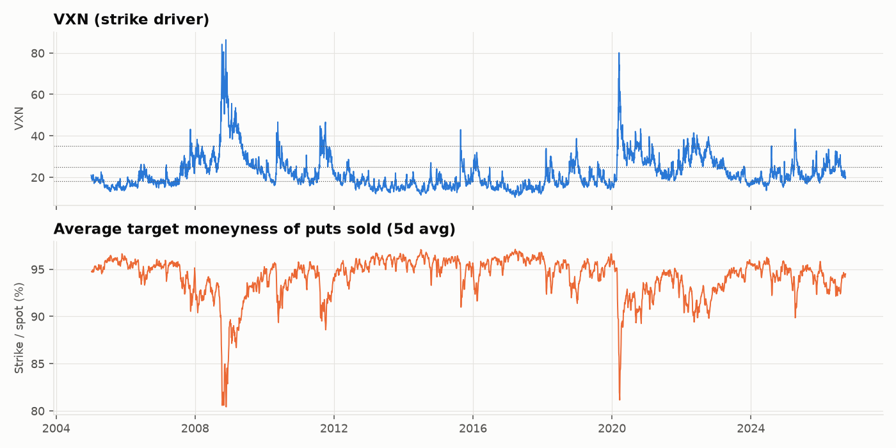
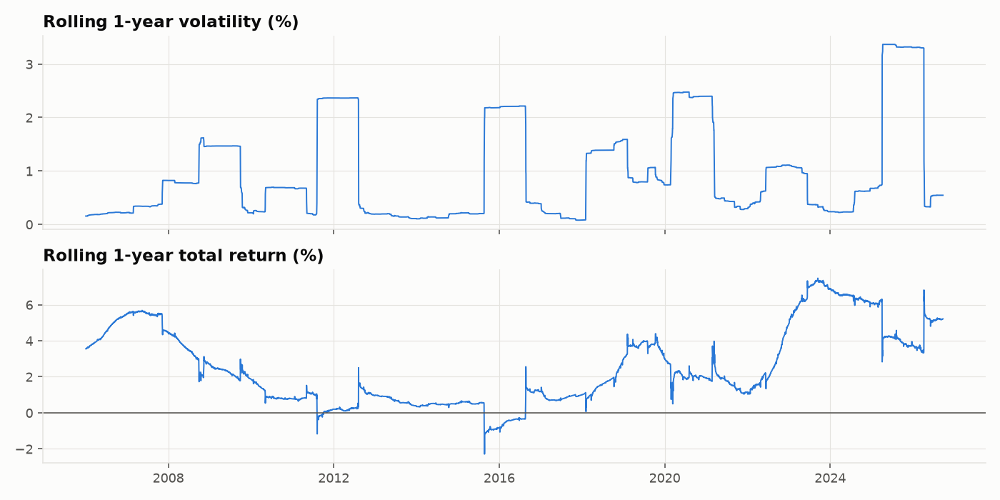
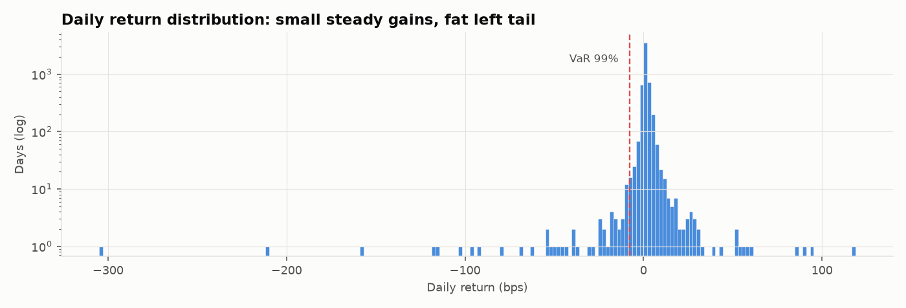

# NDX short-put ladder: systematic 1-5 day put selling

Backtest 2005-01-04 to 2026-09-22 (5,463 trading days, 16,098 puts sold).
Data: VolVue API (NDX implied vols), CBOE VXN, Yahoo (NDX OHLC, 13w T-bill), Cboe delayed option chains (spread calibration).
**Headline execution and cash model: IBKR private - QQQ options.**

## Rules

* Every trading day, sell NDX puts on the **three nearest Monday / Wednesday / Friday expiries** (each 1-5 business days out).
* **Adjusted VXN** = VXN(prev close) x sqrt(bdays / 252): VXN rescaled from 30-day to the option's own tenor.
* **Adj. vol %** = 2.5 x Adjusted VXN; **target moneyness** = 100% - Adj. vol %; strike rounded down to a 10-pt grid.
  When VXN rises, strikes automatically move further out-of-the-money (the volatility-regime adjustment).
* Executed at the **full-day TWAP**, approximated as Black-Scholes at spot (O+H+L+C)/4 and the average of the previous and current day's
  VolVue 10-day ATM put IV, with a parametric put skew (IV x (1 + 0.12 x SDs OTM), cap 2.0x).
  Costs follow the venue model below (quoted half-spread fitted on Cboe chains x share paid, plus per-contract fees).
* Held to expiry, cash-settled at the close. Each (day, expiry) tranche sells notional = NAV x 1.0 x size multiplier / 9,
  so at full size about 100% of NAV is outstanding on average.
* **Low-VXN size cut:** the size multiplier is 0.25 when VXN(prev close) <= 15, 1.0 when VXN >= 20, linear in between.
  At low VXN the strikes are close to spot and the premium barely covers costs, so exposure is cut there.
* **Cash:** margin is modelled with the CBOE short index put rule (option value + max(15% x S - OTM amount, 10% x K)).
  Margin collateral earns 100% x (T-bill - 10 bp). **Unused capital earns the money-market rate** (13w T-bill - 10 bp).

## Headline risk statistics

| Metric | Strategy (total return) | Option overlay (excess) | NDX (price) |
|---|---|---|---|
| Start | 2005-01-04 | 2005-01-04 | 2005-01-04 |
| End | 2026-09-22 | 2026-09-22 | 2026-09-22 |
| CAGR | 2.59% | 0.88% | 14.59% |
| Ann. volatility | 1.29% | 1.28% | 22.04% |
| Sharpe (vs T-bill) | 0.62 | 0.69 | 0.65 |
| Sortino | 0.73 | 0.79 | 0.92 |
| Max drawdown | -3.22% | -3.25% | -53.71% |
| Max DD peak | 2025-04-02 | 2025-04-02 | 2007-10-31 |
| Max DD trough | 2025-04-04 | 2025-04-04 | 2008-11-20 |
| Max DD recovered | 2025-08-11 | 2026-08-04 | 2011-01-03 |
| Longest underwater (days) | 531 | 990 | 1157 |
| Calmar | 0.80 | 0.27 | 0.27 |
| Daily skew | -15.50 | -15.76 | -0.06 |
| Daily excess kurtosis | 530.12 | 543.59 | 8.04 |
| Daily VaR 95% | -0.01% | -0.01% | -2.20% |
| Daily CVaR 95% | -0.11% | -0.11% | -3.29% |
| Daily VaR 99% | -0.08% | -0.09% | -3.99% |
| Daily CVaR 99% | -0.43% | -0.44% | -5.19% |
| Worst day | -3.05% | -3.06% | -12.19% |
| Worst day date | 2025-04-04 | 2025-04-04 | 2020-03-16 |
| Worst week | -3.01% | -3.08% | -13.67% |
| Worst month | -1.67% | -1.69% | -16.30% |
| Best month | 1.17% | 1.14% | 15.64% |
| % positive days | 88.12% | 80.83% | 55.35% |
| % positive months | 96.55% | 95.02% | 61.30% |

## Low-VXN size cut and money-market cash

| Return source / capital usage | Value |
|---|---|
| Money-market interest on unused capital (ann.) | 1.56% |
| Interest on margin collateral (ann.) | 0.12% |
| Option overlay P&L (ann., arith.) | 0.88% |
| Avg margin used (% NAV) | 7.2% |
| Peak margin used (% NAV) | 15.3% |
| Avg unused capital in money market (% NAV) | 92.8% |
| Avg size multiplier | 0.77 |
| % of days with a size cut | 50.2% |

| VXN regime | % of days | Avg size multiplier | Margin used (% NAV) | Unused in money market (% NAV) | MM interest (ann.) | Total return (ann., arith.) |
|---|---|---|---|---|---|---|
| Low (<18) | 35.49% | 0.41 | 4.2% | 95.8% | 1.55% | 1.76% |
| Normal (18-25) | 36.81% | 0.94 | 8.7% | 91.3% | 1.89% | 2.45% |
| Elevated (25-35) | 20.87% | 1.00 | 9.1% | 90.9% | 1.33% | 2.16% |
| Crisis (>35) | 6.81% | 1.00 | 8.6% | 91.4% | 0.47% | 8.61% |

## Trade statistics

| Trade statistic | Value |
|---|---|
| Puts sold | 16098 |
| Puts settled | 16088 |
| Avg bdays to expiry | 2.97 |
| Avg target moneyness | 94.13% |
| Min target moneyness | 70.34% |
| Avg Adj. vol % | 5.87% |
| Avg premium (bps of spot) | 1.98 |
| Median premium (index pts) | 0.56 |
| % expiring ITM (breached) | 0.65% |
| % losing trades (payoff > premium) | 0.63% |
| Avg loss / avg win (premium units) | -63.46 |
| Worst trade (x premium) | -720.68 |
| Worst breach (spot vs strike) | -29.67% |

## Market sensitivity and current exposure

| Market sensitivity | Value |
|---|---|
| Beta to NDX | 0.02 |
| Correlation to NDX | 0.38 |
| Down-market beta | 0.04 |
| Up-market beta | 0.02 |
| Avg return on NDX worst-2% days | -0.20% |
| Avg NDX on those days | -4.34% |

| Exposure as of 2026-09-22 | Value |
|---|---|
| Open put tranches | 10 |
| Gross put notional / NAV | 100.9% |
| Net delta (equity-equivalent % NAV) | 0.32% |
| Gamma (Δdelta per 1% NDX, % NAV) | -0.39% |
| Vega (NAV per +1 vol pt) | -0.001% |
| Avg gross notional over history | 69.0% |
| Max net delta over history | 45.1% |

## Risk by VXN regime (regime at trade time)

| Regime | % of days | Ann. return (arith.) | Ann. vol | Sharpe (raw) | Worst day | Avg moneyness | Avg premium (bps) | % ITM |
|---|---|---|---|---|---|---|---|---|
| Low (<18) | 35.49% | 1.76% | 0.19% | 9.04 | -0.18% | 95.88% | 1.02 | 0.67% |
| Normal (18-25) | 36.81% | 2.45% | 0.79% | 3.11 | -1.18% | 94.51% | 1.77 | 0.81% |
| Elevated (25-35) | 20.87% | 2.16% | 2.15% | 1.00 | -3.05% | 92.42% | 3.02 | 0.48% |
| Crisis (>35) | 6.81% | 8.61% | 2.57% | 3.35 | -1.16% | 88.32% | 4.88 | 0.27% |

## Stress episodes

| Episode | Strategy | Strategy max DD | Worst day | NDX |
|---|---|---|---|---|
| GFC (Sep-Nov 2008) | 0.25% | -1.16% | -1.16% | -38.08% |
| Flash crash (May 2010) | -0.23% | -0.69% | -0.47% | -9.33% |
| US downgrade (Aug 2011) | -0.99% | -2.18% | -2.11% | -7.76% |
| China deval. (Aug 2015) | -1.69% | -2.83% | -1.58% | -5.65% |
| Volmageddon (Feb 2018) | -0.31% | -1.04% | -1.02% | -8.69% |
| Q4 2018 selloff | 1.01% | -0.51% | -0.51% | -22.66% |
| COVID crash (Feb-Mar 2020) | -0.47% | -1.96% | -0.97% | -27.24% |
| 2022 bear market | 3.20% | -0.86% | -0.80% | -34.49% |
| Yen carry unwind (Aug 2024) | 0.31% | -0.44% | -0.36% | -12.64% |
| DeepSeek (Jan 2025) | 0.13% | -0.04% | -0.04% | -1.93% |
| Tariff shock (Apr 2025) | -2.65% | -3.22% | -3.05% | -15.31% |

## Calendar-year returns

| Year | Strategy | Overlay (excess) | NDX |
|---|---|---|---|
| 2005 | 3.50% | 0.44% | 2.60% |
| 2006 | 5.45% | 0.71% | 6.79% |
| 2007 | 4.45% | 0.09% | 18.67% |
| 2008 | 2.70% | 1.41% | -41.89% |
| 2009 | 1.86% | 1.81% | 53.54% |
| 2010 | 0.77% | 0.74% | 19.22% |
| 2011 | 0.20% | 0.20% | 2.70% |
| 2012 | 0.97% | 0.97% | 16.82% |
| 2013 | 0.35% | 0.35% | 34.99% |
| 2014 | 0.53% | 0.53% | 17.94% |
| 2015 | -0.83% | -0.84% | 8.43% |
| 2016 | 1.18% | 0.98% | 5.89% |
| 2017 | 1.00% | 0.18% | 31.52% |
| 2018 | 2.97% | 1.11% | -1.04% |
| 2019 | 3.00% | 1.01% | 37.96% |
| 2020 | 1.93% | 1.67% | 47.58% |
| 2021 | 1.14% | 1.14% | 26.63% |
| 2022 | 4.93% | 3.00% | -32.97% |
| 2023 | 6.82% | 1.69% | 53.81% |
| 2024 | 6.07% | 1.00% | 24.88% |
| 2025 | 3.69% | -0.33% | 20.17% |
| 2026 | 3.83% | 1.19% | 21.68% |

## Execution venues: are the bid/ask assumptions realistic?

**Market check at tomorrow's strikes** (Cboe end-of-day quotes, 2026-09-22 16:14:59):

| Expiry | Model premium (NDX pts) | Model cost, generic 5% | NDXP strike | NDXP bid / ask | NDXP half-spread % mid | QQQ strike | QQQ bid / ask | QQQ mid in NDX pts | QQQ half-spread % mid |
|---|---|---|---|---|---|---|---|---|---|
| 2026-09-25 | 4.95 | 0.25 | 29340 | 1.30 / 8.60 | 74% | 714 | 0.13 / 0.15 | 5.75 | 7% |
| 2026-09-28 | 4.94 | 0.25 | 29025 | 4.80 / 9.70 | 34% | 706 | 0.18 / 0.20 | 7.80 | 5% |
| 2026-09-30 | 5.21 | 0.26 | 28550 | 8.30 / 14.10 | 26% | 694 | 0.28 / 0.31 | 12.12 | 5% |

End-of-day quotes are wider than during the session, especially for NDXP, which quotes until 16:15 ET, so these spreads are an upper bound for a TWAP.
The quotes are from the previous close, so they have one more session to run than a trade placed tomorrow midday. That is why "QQQ mid in NDX pts"
tends to exceed "Model premium". On the 2026-09-22 calibration day, repricing the model on the same horizon put it 23% above the market for the
nearest expiry and 16-89% below for the other two. Market IV about 3 SDs out-of-the-money was 1.3-1.4x ATM, versus 1.36x in the model. So the premium
model looks roughly right to conservative, while real quoted spreads are wider than the old generic 5% rule.

**Venue cost and cash models** (per option: share of the fitted quoted half-spread paid + per-contract fees; cash in T-bills unless stated):

| Setup | Instrument | Share of half-spread paid | Fees per contract | Cash drag vs T-bill |
|---|---|---|---|---|
| IBKR private - QQQ options | QQQ | 50% | $0.73 | 10 bp |
| IBKR private - NDXP options | NDXP | 50% | $1.20 | 10 bp |
| GS institutional - NDXP options | NDXP | 25% | $0.97 | 5 bp |
| GS institutional - QQQ options | QQQ | 25% | $0.47 | 5 bp |

| Setup | CAGR | Overlay CAGR | Sharpe | CAGR since 2022 | Overlay since 2022 | Sharpe since 2022 | Cost % of premium since 2022 |
|---|---|---|---|---|---|---|---|
| Generic model (old: 5% of premium) | 2.36% | 0.78% | 0.45 | 5.18% | 1.26% | 0.49 | 5.1% |
| IBKR private - QQQ options | 2.59% | 0.88% | 0.62 | 5.51% | 1.23% | 0.68 | 6.8% |
| IBKR private - NDXP options | 2.38% | 0.67% | 0.47 | 5.24% | 0.97% | 0.53 | 19.5% |
| GS institutional - NDXP options | 2.58% | 0.83% | 0.62 | 5.50% | 1.17% | 0.67 | 9.8% |
| GS institutional - QQQ options | 2.67% | 0.92% | 0.69 | 5.63% | 1.29% | 0.74 | 4.0% |
| IBKR private - QQQ, cash left at IBKR (BM - 0.5%) | 2.35% | 0.88% | 0.45 | 5.09% | 1.23% | 0.44 | 6.8% |

The full-history columns apply today's cost structure (spreads in bps of spot, today's fees) to the whole period. The columns from 2022 onward,
when daily NDXP expiries existed, are the better guide to live trading costs. Sharpe differences across setups also reflect the cash terms:
the venue setups hold margin in T-bills, while the generic model's margin earns nothing.

**Minimum account size** (tranche = 11.1% of NAV at full size; contracts are whole numbers):

| Instrument | Contract notional | Min NAV, 1 contract per tranche at full size | Min NAV, 1 contract at the 0.25x size-cut floor |
|---|---|---|---|
| QQQ (IBKR) | $74,811 | $673,297 | $2,693,190 |
| NDXP (IBKR) | $3,072,371 | $27,651,335 | $110,605,339 |
| NDXP (GS) | $3,072,371 | $27,651,335 | $110,605,339 |
| QQQ (GS) | $74,811 | $673,297 | $2,693,190 |

## Sensitivity to design choices and model assumptions

| Variant | CAGR | Overlay CAGR | Vol | Sharpe | Max DD | Worst day | Avg moneyness | % ITM |
|---|---|---|---|---|---|---|---|---|
| Base: 2.5x, skew 0.12, 1x, cut 15-20 | 2.59% | 0.88% | 1.29% | 0.62 | -3.22% | -3.05% | 94.1% | 0.65% |
| No low-VXN size cut | 2.63% | 0.91% | 1.52% | 0.56 | -5.51% | -3.05% | 94.1% | 0.65% |
| Size cut ramp 14-18 | 2.60% | 0.89% | 1.38% | 0.59 | -3.99% | -3.05% | 94.1% | 0.65% |
| Size cut floor 0 (stop below VXN 15) | 2.57% | 0.86% | 1.24% | 0.64 | -3.22% | -3.05% | 94.1% | 0.65% |
| Margin collateral earns nothing | 2.46% | 0.88% | 1.29% | 0.53 | -3.23% | -3.05% | 94.1% | 0.65% |
| No interest at all (pure overlay) | 0.88% | 0.88% | 1.28% | -0.68 | -3.25% | -3.06% | 94.1% | 0.65% |
| Multiplier 2.0x | 3.62% | 1.89% | 2.14% | 0.85 | -4.63% | -4.26% | 95.3% | 1.56% |
| Multiplier 3.0x | 2.09% | 0.39% | 0.78% | 0.40 | -2.18% | -1.95% | 92.9% | 0.30% |
| No skew (flat ATM vol) | 1.41% | -0.28% | 1.14% | -0.31 | -3.59% | -3.11% | 93.8% | 1.13% |
| Steeper skew 0.20 | 4.72% | 2.97% | 1.36% | 2.11 | -3.18% | -2.99% | 94.1% | 0.65% |
| Double t-costs | 2.48% | 0.77% | 1.29% | 0.54 | -3.23% | -3.05% | 94.1% | 0.66% |
| Sell on the bid (pay full half-spread) | 2.54% | 0.83% | 1.29% | 0.59 | -3.23% | -3.05% | 94.1% | 0.65% |
| Leverage 2x | 3.48% | 1.75% | 2.58% | 0.66 | -6.47% | -6.12% | 94.1% | 0.65% |
| Leverage 3x | 4.37% | 2.63% | 3.88% | 0.67 | -9.71% | -9.20% | 94.1% | 0.65% |

## Next trading day: trades to place

Based on the 2026-09-22 close (NDX 30,723.71, VXN 20.18, NDX 10d ATM put IV 17.11),
sized for NAV $1,000,000 with IBKR private - QQQ options.
The strike is computed off the last close; recompute against the live TWAP level when executing.

| expiry | expiry_day | bdays | adj_vxn_pct | adj_vol_pct | target_moneyness_pct | strike | model_iv_pct | est_premium_pts | est_premium_bps | delta | size_mult | notional_pct_nav | instrument | instrument_strike | contracts | est_cost_pts_ndx |
|---|---|---|---|---|---|---|---|---|---|---|---|---|---|---|---|---|
| 2026-09-25 | Friday | 2 | 1.798 | 4.494 | 95.51 | 29340.0 | 22.66 | 4.95 | 1.61 | -0.0194 | 1.0 | 11.11 | QQQ | 714.0 | 1 | 0.487 |
| 2026-09-28 | Monday | 3 | 2.202 | 5.505 | 94.5 | 29030.0 | 22.88 | 4.94 | 1.61 | -0.0165 | 1.0 | 11.11 | QQQ | 706.0 | 1 | 0.487 |
| 2026-09-30 | Wednesday | 5 | 2.843 | 7.106 | 92.89 | 28540.0 | 23.1 | 5.21 | 1.7 | -0.014 | 1.0 | 11.11 | QQQ | 694.0 | 1 | 0.492 |

## Caveats

* **Option prices are modelled, not traded quotes.** VolVue provides constant-maturity ATM IV but no strike-level quotes, so OTM premia rely on the
  parametric skew. The sensitivity table shows how results move with the skew assumption, so treat absolute premia as approximate.
* NDX Monday/Wednesday expiries were only listed from the late 2010s (daily NDXP from 2022). Earlier years assume those expiries existed.
* VXN before the CBOE CSV history (and on 1182 days in this sample) uses VolVue NDX 30d mean IV x 1.138.
  79 bad VolVue ATM IV prints were replaced by VXN x rolling median ratio.
* TWAP uses (O+H+L+C)/4 and interpolated IV. Intraday path, early-close days and settlement-price nuances are ignored.
* Margin uses the CBOE minimum for short broad-index puts. A broker may charge more (house margin), which leaves less capital in the money market.
  The money-market rate is proxied by the 13w T-bill (^IRX) minus a fee.
* The size-cut thresholds (15/20) were chosen after looking at P&L by VXN bucket, so they are in-sample. The sensitivity rows show that nearby choices behave similarly.
