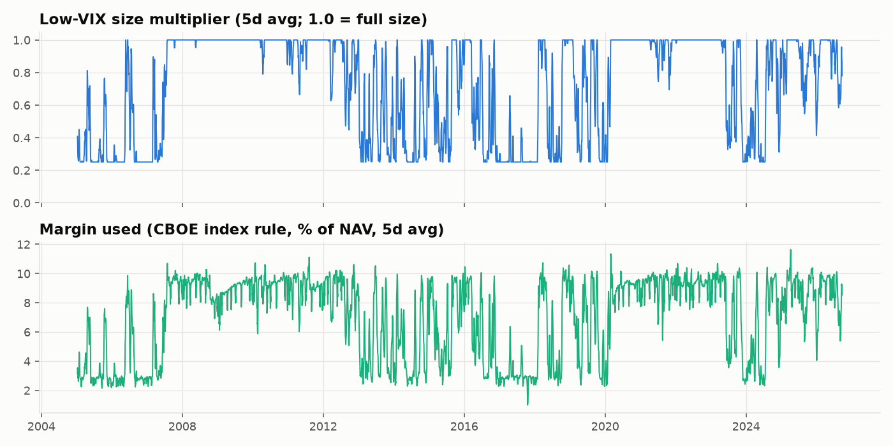
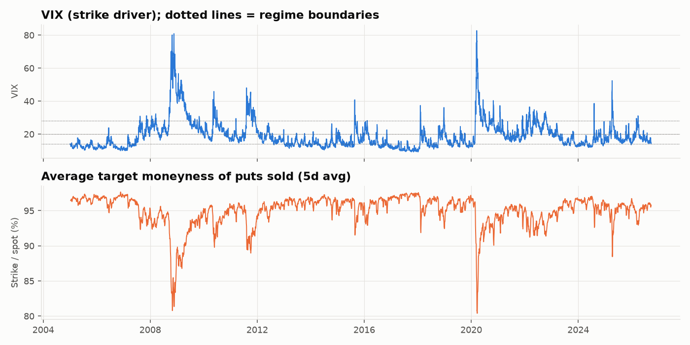

# S&P 500 short-put ladder: systematic 1-5 day put selling

Backtest 2005-01-04 to 2026-09-22 (5,463 trading days, 16,095 puts sold per route).
**Routes: IBKR private - XSP options (private) and GS institutional - SPY options (institutional).**
**Returns are option P&L only: no money-market or collateral interest is included.** Add your cash yield on top if the account holds T-bills.
Data: VolVue API (SPX implied vols), CBOE VIX, Yahoo (SPX OHLC), Cboe delayed option chains (spread and skew calibration).

## Rules

* Every trading day, sell SPX puts on the **three nearest Monday / Wednesday / Friday expiries** (each 1-5 business days out).
* **Adjusted VIX** = VIX(prev close) x sqrt(bdays / 252): VIX rescaled from 30 days to the option's own tenor.
* **Adj. vol %** = 2.5 x Adjusted VIX; **target moneyness** = 100% - Adj. vol %. The strike is rounded down to the instrument's grid.
  When VIX rises, strikes automatically move further out-of-the-money (the volatility-regime adjustment).
* Executed at the **full-day TWAP**, approximated as Black-Scholes at spot (O+H+L+C)/4 and the average of the previous and current day's
  VolVue 10-day ATM put IV, with a put skew of IV x (1 + 0.15 x SDs OTM), cap 2.0x, calibrated on the SPX option chains.
  Costs per option: share of the quoted half-spread paid + per-contract fees (venue table below).
* Held to expiry, cash-settled at the close. Each (day, expiry) tranche sells notional = NAV x 1.0 x size multiplier / 9,
  so at full size about 100% of NAV is outstanding on average.
* **Low-VIX size cut:** the size multiplier is 0.25 when VIX(prev close) <= 13, 1.0 when VIX >= 17, linear in between.

## Headline risk statistics

Strategy Sharpe ratios are computed on option P&L, which is already an excess return. The index Sharpe is measured against T-bills.

| Metric | IBKR XSP | GS SPY | S&P 500 (price) |
|---|---|---|---|
| Start | 2005-01-04 | 2005-01-04 | 2005-01-04 |
| End | 2026-09-22 | 2026-09-22 | 2026-09-22 |
| CAGR | 1.04% | 1.11% | 8.99% |
| Ann. volatility | 1.49% | 1.49% | 18.98% |
| Sharpe | 0.70 | 0.75 | 0.46 |
| Sortino | 0.82 | 0.88 | 0.64 |
| Max drawdown | -3.77% | -3.76% | -56.78% |
| Max DD peak | 2025-04-02 | 2025-04-02 | 2007-10-09 |
| Max DD trough | 2025-04-08 | 2025-04-08 | 2009-03-09 |
| Max DD recovered | not yet | not yet | 2013-03-28 |
| Longest underwater (days) | 538 | 538 | 1996 |
| Calmar | 0.27 | 0.30 | 0.16 |
| Daily skew | -14.79 | -14.78 | -0.21 |
| Daily excess kurtosis | 584.83 | 584.63 | 13.10 |
| Daily VaR 95% | -0.01% | -0.01% | -1.76% |
| Daily CVaR 95% | -0.12% | -0.12% | -2.93% |
| Daily VaR 99% | -0.09% | -0.09% | -3.45% |
| Daily CVaR 99% | -0.48% | -0.48% | -5.10% |
| Worst day | -3.47% | -3.46% | -11.98% |
| Worst day date | 2025-04-04 | 2025-04-04 | 2020-03-16 |
| Worst week | -3.55% | -3.55% | -18.20% |
| Worst month | -2.60% | -2.59% | -16.94% |
| Best month | 1.05% | 1.07% | 12.68% |
| % positive days | 80.65% | 82.02% | 54.55% |
| % positive months | 96.55% | 96.55% | 64.37% |

## Low-VIX size cut

| IBKR XSP | With cut (13-17) | No cut | With cut, since 2022 | No cut, since 2022 |
|---|---|---|---|---|
| CAGR | 1.04% | 1.07% | 0.70% | 0.87% |
| Ann. volatility | 1.49% | 1.76% | 1.87% | 1.89% |
| Sharpe | 0.70 | 0.61 | 0.38 | 0.47 |
| Max drawdown | -3.77% | -4.80% | -3.77% | -3.77% |
| Worst month | -2.60% | -3.52% | -2.60% | -2.60% |

| VIX regime | % of days | Avg size multiplier | Margin used (% NAV) | Return (ann., arith.) |
|---|---|---|---|---|
| Low (<14) | 28.96% | 0.28 | 3.2% | 0.09% |
| Normal (14-20) | 38.61% | 0.83 | 8.1% | 0.40% |
| Elevated (20-28) | 22.04% | 1.00 | 9.4% | 1.81% |
| Crisis (>28) | 10.38% | 1.00 | 8.8% | 4.44% |

## Trade statistics

| Trade statistic | IBKR XSP | GS SPY |
|---|---|---|
| Puts sold | 16095 | 16102 |
| Puts settled | 16085 | 16092 |
| Avg bdays to expiry | 2.97 | 2.97 |
| Avg target moneyness | 94.97% | 94.97% |
| Min target moneyness | 72.13% | 72.13% |
| Avg Adj. vol % | 5.03% | 5.03% |
| Avg premium (bps of spot) | 2.30 | 2.42 |
| Median premium (index pts) | 0.36 | 0.39 |
| % expiring ITM (breached) | 0.67% | 0.67% |
| % losing trades (payoff > premium) | 0.67% | 0.67% |
| Avg loss / avg win (premium units) | -77.65 | -73.38 |
| Worst trade (x premium) | -634.81 | -501.59 |
| Worst breach (spot vs strike) | -28.40% | -28.40% |

## Market sensitivity and current exposure

| Market sensitivity | IBKR XSP | GS SPY |
|---|---|---|
| Beta to index | 0.03 | 0.03 |
| Correlation to index | 0.43 | 0.43 |
| Down-market beta | 0.06 | 0.06 |
| Up-market beta | 0.04 | 0.04 |
| Avg return on the index's worst-2% days | -0.24% | -0.23% |
| Avg index return on those days | -4.08% | -4.08% |

| Exposure as of 2026-09-22 (IBKR XSP) | Value |
|---|---|
| Open put tranches | 10 |
| Gross put notional / NAV | 73.9% |
| Margin used / NAV (CBOE index rule) | 7.9% |
| Net delta (equity-equivalent % NAV) | 0.29% |
| Gamma (Δdelta per 1% move, % NAV) | -0.48% |
| Vega (NAV per +1 vol pt) | -0.001% |
| Avg gross notional over history | 66.2% |
| Max net delta over history | 50.5% |

## Risk by VIX regime (IBKR XSP, regime at trade time)

| VIX regime | % of days | Ann. return (arith.) | Ann. vol | Sharpe (raw) | Worst day | Avg moneyness | Avg premium (bps) | % ITM |
|---|---|---|---|---|---|---|---|---|
| Low (<14) | 28.96% | 0.09% | 0.09% | 1.06 | -0.18% | 96.76% | 1.06 | 0.65% |
| Normal (14-20) | 38.61% | 0.40% | 0.55% | 0.74 | -1.12% | 95.63% | 1.78 | 0.59% |
| Elevated (20-28) | 22.04% | 1.81% | 1.08% | 1.67 | -1.13% | 93.86% | 3.09 | 0.84% |
| Crisis (>28) | 10.38% | 4.44% | 4.22% | 1.05 | -3.47% | 89.97% | 5.97 | 0.66% |

## Stress episodes

| Episode | IBKR XSP | GS SPY | S&P 500 | Worst day (IBKR XSP) |
|---|---|---|---|---|
| GFC (Sep-Nov 2008) | 1.19% | 1.23% | -31.09% | -0.89% |
| Flash crash (May 2010) | 0.19% | 0.20% | -9.73% | -0.45% |
| US downgrade (Aug 2011) | -1.45% | -1.44% | -9.38% | -2.83% |
| China deval. (Aug 2015) | -1.47% | -1.47% | -5.71% | -1.54% |
| Volmageddon (Feb 2018) | -0.45% | -0.45% | -8.82% | -1.12% |
| Q4 2018 selloff | 0.19% | 0.21% | -19.32% | -0.33% |
| COVID crash (Feb-Mar 2020) | -1.20% | -1.19% | -33.61% | -1.60% |
| 2022 bear market | 1.54% | 1.63% | -24.82% | -1.13% |
| Yen carry unwind (Aug 2024) | -0.24% | -0.23% | -6.77% | -0.54% |
| DeepSeek (Jan 2025) | 0.02% | 0.02% | -1.28% | -0.00% |
| Tariff shock (Apr 2025) | -3.70% | -3.69% | -13.61% | -3.47% |

## Calendar-year returns

| Year | IBKR XSP | GS SPY | S&P 500 |
|---|---|---|---|
| 2005 | 0.36% | 0.39% | 3.84% |
| 2006 | 0.47% | 0.50% | 13.62% |
| 2007 | 1.39% | 1.46% | 3.53% |
| 2008 | 3.65% | 3.77% | -38.49% |
| 2009 | 3.09% | 3.20% | 23.45% |
| 2010 | 1.79% | 1.89% | 12.78% |
| 2011 | 0.75% | 0.86% | -0.00% |
| 2012 | 1.61% | 1.70% | 13.41% |
| 2013 | 0.81% | 0.86% | 29.60% |
| 2014 | 0.63% | 0.68% | 11.39% |
| 2015 | -0.13% | -0.07% | -0.73% |
| 2016 | 1.12% | 1.18% | 9.54% |
| 2017 | 0.13% | 0.15% | 19.42% |
| 2018 | 0.34% | 0.41% | -6.24% |
| 2019 | 0.91% | 0.97% | 28.88% |
| 2020 | 0.89% | 1.00% | 16.26% |
| 2021 | 0.92% | 1.01% | 26.89% |
| 2022 | 2.55% | 2.67% | -19.44% |
| 2023 | 1.47% | 1.54% | 24.23% |
| 2024 | 0.44% | 0.50% | 23.31% |
| 2025 | -1.52% | -1.44% | 16.39% |
| 2026 | 0.90% | 0.97% | 13.40% |

## Execution venues

**Market check at tomorrow's strikes** (Cboe end-of-day quotes, 2026-09-22 16:14:59; mids converted to SPX points):

| Expiry | Instrument | Strike | Bid / ask | Mid (index pts) | Model premium (index pts) | Half-spread % mid | Open interest | Volume |
|---|---|---|---|---|---|---|---|---|
| 2026-09-25 | SPXW | 7515 | 0.85 / 0.95 | 0.90 | 0.91 | 6% | 638 | 24 |
| 2026-09-25 | SPY | 748 | 0.08 / 0.09 | 0.85 | 0.91 | 6% | 2047 | 1337 |
| 2026-09-25 | XSP | 751 | 0.07 / 0.10 | 0.85 | 0.91 | 18% | 263 | 15 |
| 2026-09-28 | SPXW | 7460 | 1.15 / 1.30 | 1.23 | 0.94 | 6% | 134 | 152 |
| 2026-09-28 | SPY | 743 | 0.12 / 0.13 | 1.25 | 0.94 | 4% | 839 | 87 |
| 2026-09-28 | XSP | 746 | 0.11 / 0.14 | 1.25 | 0.94 | 12% | 60 | 3 |
| 2026-09-30 | SPXW | 7375 | 1.60 / 1.80 | 1.70 | 0.99 | 6% | 460 | 100 |
| 2026-09-30 | SPY | 734 | 0.17 / 0.18 | 1.76 | 0.99 | 3% | 1812 | 128 |
| 2026-09-30 | XSP | 737 | 0.16 / 0.19 | 1.75 | 0.99 | 9% | 36 | 0 |

End-of-day quotes are wider than during the session, so these spreads are an upper bound for a TWAP. The quotes also have one more session to run
than a trade placed tomorrow midday, so market mids for the longer expiries tend to exceed the model premium.

**Venue cost models** (spreads fitted on the 2026-09-22 Cboe chains around the strategy's strikes):

| Setup | Instrument | Settlement | Quoted half-spread (bps of spot) | Share of half-spread paid | Fees per contract |
|---|---|---|---|---|---|
| IBKR private - XSP options | XSP | Cash-settled, European, PM | 0.167 + 0.013 x premium | 50% | $0.77 |
| GS institutional - SPY options | SPY | Physical (shares), American | 0.065 + 0.000 x premium | 25% | $0.47 |
| IBKR private - SPY options (comparison) | SPY | Physical (shares), American | 0.065 + 0.000 x premium | 50% | $0.70 |
| GS institutional - SPXW options (comparison) | SPXW | Cash-settled, European, PM | 0.056 + 0.010 x premium | 25% | $0.82 |

| Setup | CAGR | Sharpe | Max DD | Cost % of premium | CAGR since 2022 | Sharpe since 2022 | Max DD since 2022 | Cost % of premium since 2022 |
|---|---|---|---|---|---|---|---|---|
| IBKR private - XSP options | 1.04% | 0.70 | -3.77% | 8.6% | 0.69% | 0.38 | -3.77% | 8.7% |
| GS institutional - SPY options | 1.11% | 0.75 | -3.76% | 3.4% | 0.77% | 0.42 | -3.76% | 3.4% |
| IBKR private - SPY options (comparison) | 1.08% | 0.73 | -3.76% | 5.4% | 0.74% | 0.41 | -3.76% | 5.4% |
| GS institutional - SPXW options (comparison) | 1.14% | 0.77 | -3.76% | 1.3% | 0.80% | 0.44 | -3.76% | 1.3% |

The full-history columns apply today's cost structure to the whole period. The columns from 2022 onward are the better guide to live trading.

**Minimum account size** (tranche = 11.1% of NAV at full size; contracts are whole numbers):

| Instrument | Contract notional | Min NAV, 1 contract per tranche at full size | Min NAV, 1 contract at the 0.25x floor |
|---|---|---|---|
| XSP | $77,629 | $698,663 | $2,794,653 |
| SPY | $77,321 | $695,892 | $2,783,568 |
| SPXW | $776,297 | $6,986,669 | $27,946,676 |

## S&P 500 vs Nasdaq-100 (same rules, realistic venues, no interest)

| Setup | Strike driver | CAGR | Vol | Sharpe | Max DD | Worst day | CAGR since 2022 | Sharpe since 2022 |
|---|---|---|---|---|---|---|---|---|
| S&P 500 via IBKR private - XSP options | VIX | 1.04% | 1.49% | 0.70 | -3.77% | -3.47% | 0.70% | 0.38 |
| S&P 500 via GS institutional - SPY options | VIX | 1.11% | 1.49% | 0.75 | -3.76% | -3.46% | 0.78% | 0.43 |
| Nasdaq-100 via IBKR private - QQQ options | VXN | 0.88% | 1.28% | 0.69 | -3.25% | -3.06% | 1.24% | 0.74 |
| Nasdaq-100 via GS institutional - NDXP options | VXN | 0.83% | 1.28% | 0.65 | -3.25% | -3.06% | 1.18% | 0.70 |

## Sensitivity to design choices and model assumptions (IBKR XSP)

| Variant | CAGR | Vol | Sharpe | Max DD | Worst day | Avg moneyness | % ITM |
|---|---|---|---|---|---|---|---|
| Base: 2.5x, skew 0.15, 1x, cut 13-17 | 1.04% | 1.49% | 0.70 | -3.77% | -3.47% | 95.0% | 0.67% |
| No low-vol size cut | 1.07% | 1.76% | 0.61 | -4.80% | -3.47% | 95.0% | 0.67% |
| Size cut ramp 12-16 | 1.04% | 1.56% | 0.67 | -3.80% | -3.47% | 95.0% | 0.67% |
| Size cut ramp 15-20 | 0.95% | 1.40% | 0.68 | -3.70% | -3.40% | 95.0% | 0.67% |
| Size cut floor 0 (stop at low vol) | 1.02% | 1.44% | 0.71 | -3.77% | -3.47% | 95.0% | 0.67% |
| Multiplier 2.0x | 2.01% | 2.31% | 0.87 | -6.10% | -4.61% | 96.0% | 1.34% |
| Multiplier 3.0x | 0.50% | 0.95% | 0.52 | -2.44% | -2.35% | 93.9% | 0.35% |
| No skew (flat ATM vol) | -0.38% | 1.34% | -0.28 | -9.01% | -3.53% | 93.8% | 1.89% |
| Flatter skew 0.10 | 0.22% | 1.46% | 0.16 | -4.05% | -3.49% | 94.9% | 0.72% |
| Steeper skew 0.20 | 2.22% | 1.53% | 1.45 | -3.74% | -3.43% | 95.0% | 0.67% |
| Double t-costs | 0.91% | 1.49% | 0.62 | -3.77% | -3.47% | 95.0% | 0.67% |
| Sell on the bid (pay full half-spread) | 0.97% | 1.49% | 0.66 | -3.77% | -3.47% | 95.0% | 0.67% |
| Leverage 2x | 2.07% | 3.00% | 0.70 | -7.53% | -6.94% | 95.0% | 0.67% |
| Leverage 3x | 3.11% | 4.52% | 0.70 | -11.28% | -10.43% | 95.0% | 0.67% |

## Next trading day: orders to place

Based on the 2026-09-22 close (SPX 7,762.97, VIX 14.21, SPX 10d ATM put IV 11.16).
Strikes are computed off the last close; recompute against the live TWAP level when executing. Premium and cost are per option, in instrument points.

**IBKR private - XSP options, NAV $1,000,000:**

| expiry | expiry_day | bdays | adj_vix_pct | adj_vol_pct | target_moneyness_pct | strike | est_premium_pts | size_mult | notional_pct_nav | instrument | instrument_strike | est_premium_instr | est_cost_instr | contracts |
|---|---|---|---|---|---|---|---|---|---|---|---|---|---|---|
| 2026-09-25 | Friday | 2 | 1.266 | 3.165 | 96.84 | 7515.0 | 0.91 | 0.477 | 5.3 | XSP | 751.0 | 0.091 | 0.015 | 1 |
| 2026-09-28 | Monday | 3 | 1.55 | 3.876 | 96.12 | 7460.0 | 0.94 | 0.477 | 5.3 | XSP | 746.0 | 0.094 | 0.015 | 1 |
| 2026-09-30 | Wednesday | 5 | 2.002 | 5.004 | 95.0 | 7370.0 | 0.99 | 0.477 | 5.3 | XSP | 737.0 | 0.099 | 0.015 | 1 |

**GS institutional - SPY options, NAV $100,000,000:**

| expiry | expiry_day | bdays | adj_vix_pct | adj_vol_pct | target_moneyness_pct | strike | est_premium_pts | size_mult | notional_pct_nav | instrument | instrument_strike | est_premium_instr | est_cost_instr | contracts |
|---|---|---|---|---|---|---|---|---|---|---|---|---|---|---|
| 2026-09-25 | Friday | 2 | 1.266 | 3.165 | 96.84 | 7515.0 | 0.91 | 0.477 | 5.3 | SPY | 748.0 | 0.091 | 0.006 | 69 |
| 2026-09-28 | Monday | 3 | 1.55 | 3.876 | 96.12 | 7460.0 | 0.94 | 0.477 | 5.3 | SPY | 743.0 | 0.093 | 0.006 | 69 |
| 2026-09-30 | Wednesday | 5 | 2.002 | 5.004 | 95.0 | 7370.0 | 0.99 | 0.477 | 5.3 | SPY | 734.0 | 0.099 | 0.006 | 69 |

## Caveats

* **Option prices are modelled, not traded quotes.** VolVue provides constant-maturity ATM IV but no strike-level quotes, so OTM premia rely on the
  parametric skew, calibrated on one day's chains. The sensitivity table shows how results move with the skew assumption.
* Monday/Wednesday expiries were only listed from the mid-2010s (SPXW) and later for XSP and SPY. Earlier years assume those expiries existed.
* VIX gaps in the CBOE history (0 days in this sample) are filled with VolVue 30d mean IV x 1.184.
  31 bad VolVue ATM IV prints were replaced by VIX x rolling median ratio.
* The model settles every option in cash at the close. SPY options are American-style and physically settled. Assignment delivers shares, which then
  carry overnight gap risk until sold. Close positions that are near the money before expiry-day close.
* TWAP uses (O+H+L+C)/4 and interpolated IV. Intraday path, early-close days and settlement-price nuances are ignored.
* The size-cut thresholds were chosen after looking at P&L by VIX bucket, so they are in-sample.
